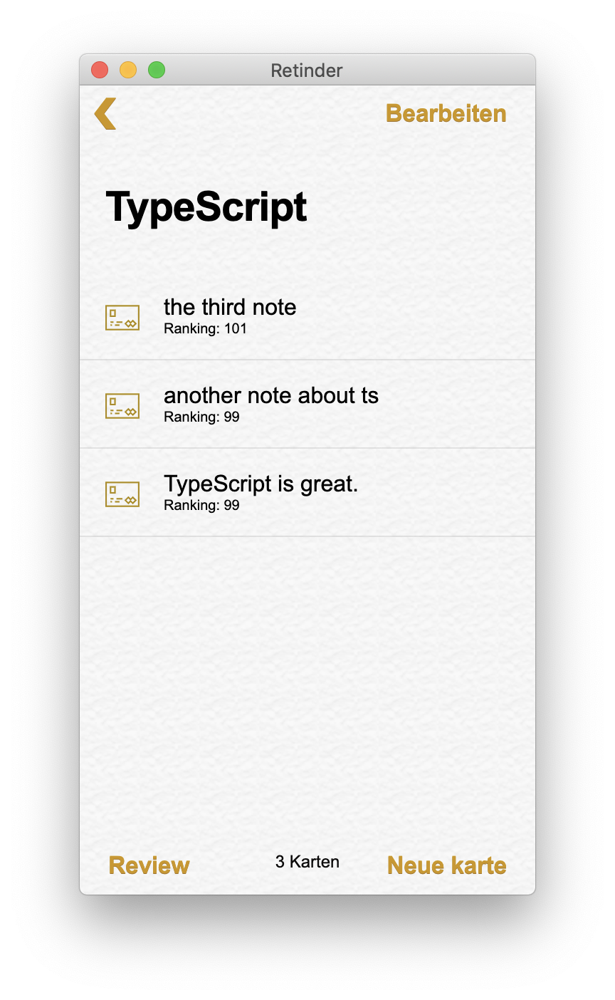
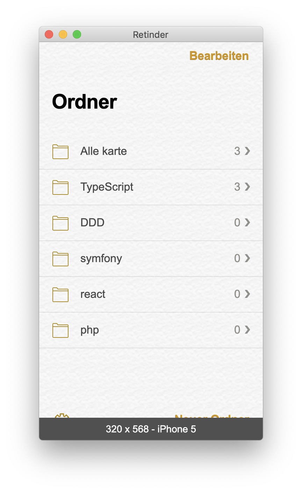

<div align="center">
  
  <table>
  <tr>
  <td></td>
  <td></td>
  </tr>
  </table>
  <h3>A React Clone for iOS note app</h3>
  <p>A React clone for iOS note app</p>

  <p>
    <a href="#">
      
    </a>
    <a href="#">
      
    </a>
  </p>
</div>

---

## install
```bash
npm install 
```


## start
```bash
npm run start 
```

## build
```bash
npm run build 
```

## licence

MIT [@vikbert](https://vikbert.github.io/)
